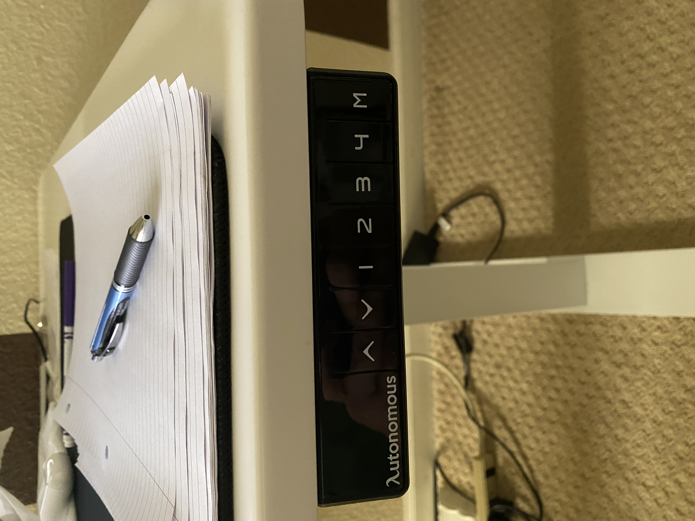

# Autonomous Edition Smart Hybrid Dual Motor Electric Standing Desk Frame - User eXperience

## By Bryant Hoang, 02/25/2022

[Back to Home](https://github.com/UsabilityEngineering/ux-portfolio-bhoang1998)

The Autonomous Edition Smart Hybrid Dual Motor Electric Standing Desk Frame is a decent design that has a few options that seem self explanatory, but could use with a little context. This desk changes height based on the user's preference, but you need to adjust this using the buttons.

This is confusing as there seems to be no indicators to how the height based on the number options and the same to the "M" option that doesn't have and context as to what it does. The only saving grace is that its **learnable** with the use of the lowering or raising arrows. The **safety** of this device is pretty bad as there is no safety measure to ensure nothing is crushed with lowering of the desk. It is **useful** by adjusting the desk to suit the needs be it to adjust desk height based on the user. 

Overall, it is an enjoyable device, but it lacks **error tolerance** and **safety**.

