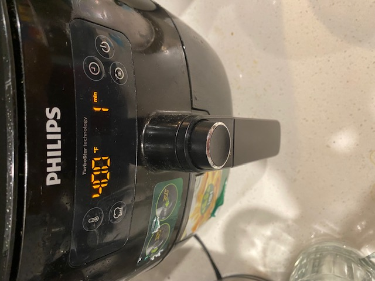

# Philiphs Premium Air Fryer HD9741 - User eXperience

## By Bryant Hoang, 04/15/2022

[Back to Home](https://github.com/UsabilityEngineering/ux-portfolio-bhoang1998)

The Philips Premium Air Fryer HD9741 is a great design that has a few options that has just images, but could get confusing when used. This Air Fryer allows the user to cook or reheat food items using convectionally heated air. There are 4 main options that seem self explanatory to some, but might be confusing to others. The button on the top left has an image of a thermometer that, when pressed, allows the user to change the temperature that that Air Fryer is set to. The user will realize that this is the case when adjusting the knob at the center, right above the handle sticking out. Once the user presses the temperature button and then turns the knob, a **visual feedback** is given by the changing of the number on the left that is next to the farenheit symbol for temperature. 

Then there is the similarly designed time button signified by the clock symbol on the button. This foolows the same principal as the temperature button in which you press the time button and turn the knob that changes the time shown on the right. The concept is that spinning the knob left decreases and spinning right increases the tempearture/time.

A **touch feedback** is given back by the knob as you can distinctly tell a unit of a spin from the knob as it seems to give more of a resistance when a unit has been reached.

There is also the self explanatory power button on the right that users will easily recognize and know what to do as this is a similar process across devices as pressing the button once will turn on the device and another press of the button will turn off the device.

The button on the bottm left with they symbol of a chef's hat is a little more difficult to recognize as once the button is pressed, then there will be what I asume to be preset temperature and times and a symbol of a selected option on the bottom left of the display with a blinking symbol of the item to be cooked. Ex. a image of a fish with preset time and temperature. This is questionable as there are no specifics on size and weight of the item being cooked as it seems to just be a general preset for fish. Which could be very dangerous and not meet with **safety** policy as it could potential become a piece of charcoal in the air fryer if left too long.

Overall the air fryer is **effective** in what it does and has a **minimal design** that is very straight to the point without too many additional features that get in the way of **learning** how to use the device. Since this device is supposed to be used often there would be no reason for it to be **memorable**, but is **useful** in everyday life without the worry of something catching on fire as in a stove top or oven that could place a **safety** risk. There is little **error tollerance** as once you select a setting, there is no other way to verify if this is the proper cooking temperature or time and it leaves the used to handle all the hard thinking.
